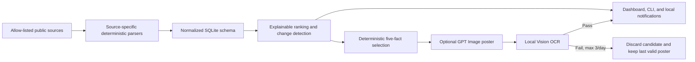

<div align="center">

# AI Resource Radar

**Find free AI tokens and GPU compute, compare market prices, and get a verified daily briefing.**

[](https://github.com/ai-resource-radar/ai-resource-radar/actions/workflows/ci.yml)
[](https://github.com/ai-resource-radar/ai-resource-radar/releases/latest)
[](https://www.python.org/)
[](LICENSE)

[中文](README.zh-CN.md) · [Quick start](#quick-start) · [How it works](#how-it-works) · [Security](docs/SECURITY.md)

</div>


AI Resource Radar is a local-first tracker for AI free tiers and market prices. It tells you
**what is free, how much you get, when it resets, what the restrictions are, and how to claim it**.
Every recommendation keeps its source and verification time.

The default collection pipeline is deterministic: **no AI, API key, cookie, or account data is
required**. AI is used only by the optional daily poster.

## Why this project

Free tiers and AI prices change frequently, while ordinary link lists quickly become stale.
This project turns public source material into a small, explainable local database:

| Capability | What you get |
| --- | --- |
| Free token radar | Quota, reset period, card/phone requirements, mainland status, official evidence, and claim steps |
| Free GPU and grants | GPU time or credit, eligibility, expiry, limitations, and a direct official link |
| Token price leaderboard | Input/output/cached prices normalized per 1M tokens, with sorting and filters |
| GPU price leaderboard | On-demand GPU prices normalized per hour for practical comparison |
| Change detection | New offers, quota or restriction changes, removals, and upcoming expiry |
| Daily poster | Three free resources plus one token and one GPU price, drawn as one image and checked by local OCR |

## Quick start

Requires Python 3.11 or newer. Install the latest published wheel in an isolated environment:

```bash
python3 -m venv .venv
source .venv/bin/activate
python -m pip install \
  https://github.com/ai-resource-radar/ai-resource-radar/releases/download/v0.1.0/ai_resource_radar-0.1.0-py3-none-any.whl

ai-radar refresh
ai-radar dashboard --open
```

The dashboard is available only on `127.0.0.1:18766`.

On macOS, install the dashboard, menu bar helper, and 08:00 daily job:

```bash
ai-radar service install
ai-radar service status
```

To uninstall the services without deleting the database:

```bash
ai-radar service uninstall
```

## Platform support

| Feature | macOS | Linux |
| --- | :---: | :---: |
| Collection, ranking, SQLite, and CLI | ✅ | ✅ |
| Local dashboard | ✅ | ✅ |
| GPT Image daily poster with Vision OCR | ✅ | — |
| Menu bar notifications and LaunchAgent | ✅ | — |

Windows is not tested yet. Linux CI verifies the deterministic core and dashboard; macOS CI also
compiles and tests the Vision OCR and menu bar helpers.

## What it tracks

The built-in adapters currently cover 14 sources:

| Category | Sources | Cadence |
| --- | --- | --- |
| Free token/API | OpenRouter, Groq, Gemini, Cloudflare Workers AI | Daily |
| Free GPU and credits | Hugging Face ZeroGPU, Modal, Lightning AI, Kaggle, Google Colab | Daily |
| GPU market prices | Modal, RunPod, Lambda GPU Cloud, Vast.ai | Daily |
| Token price baseline | `pydantic/genai-prices` | Daily |
| Community discovery | `mnfst/awesome-free-llm-apis` | Weekly |

Community sources can discover candidates but cannot upgrade an offer to “officially verified”.
Each HTTPS source is allow-listed, limited to 16 MB, isolated on failure, and supports
ETag/Last-Modified caching.

## Explainable ranking

The radar deliberately avoids an opaque score:

| Tier | Meaning |
| --- | --- |
| A | Officially verified, no card, recurring free quota, and no explicit mainland restriction |
| B | Officially verified and no card, but quota varies or eligibility conditions apply |
| C | Application, card, region, or one-time trial restrictions apply |
| D | Community discovery only; official verification is pending |

Within a tier, results are ordered by mainland availability, estimated value, and recent changes.
The dashboard shows the reasons instead of hiding them inside a number.

## Daily poster

<p align="center">
  
</p>

> The image above is an explicitly labelled example. Always check the current official source
> before using an offer.

The poster model draws the complete image; the application never overlays or rewrites its text.
The five facts are selected by deterministic code. macOS Vision then checks the title, date,
providers, quotas, prices, and unexpected numbers.

```bash
ai-radar poster key set
ai-radar poster generate
ai-radar poster latest
```

The OpenAI key is entered with a hidden prompt and stored only in macOS Keychain. GPT Image 2
requires paid API access. All automatic and manual operations share a hard limit of three image
calls per day. If every candidate fails OCR, nothing is published and the last valid poster stays
visible.

## How it works



One failed source never clears data from other sources. A missing offer is removed only after two
successful parses both confirm its absence. Parser drift keeps the last trusted value and marks the
source for verification.

## Useful commands

```bash
# Refresh all due sources, or bypass cadence
ai-radar refresh
ai-radar refresh --force

# Browse verified, no-card resources
ai-radar list --verified-only --no-card
ai-radar list --kind gpu --no-card

# Review recent changes
ai-radar changes --days 30

# Run the complete daily workflow
ai-radar daily
```

Run `ai-radar <command> --help` for every filter and option.

## Data, privacy, and storage

- SQLite schema v4 uses file mode `0600`; no secrets, cookies, or account data are stored.
- Full fetched pages are parsed in memory and are not archived.
- Fetch logs are retained for 90 days; ordinary changes and delivered notifications for 365 days.
- Important free-tier changes and unread notifications are retained.
- Posters are retained for 90 days; failed candidates are deleted immediately.
- Periodic cleanup and threshold-based `VACUUM` prevent unbounded growth.
- The dashboard accepts only loopback Host/Origin requests and serves no remote assets.

See [Architecture](docs/ARCHITECTURE.md) and [Security](docs/SECURITY.md) for details.

## Development

```bash
git clone https://github.com/ai-resource-radar/ai-resource-radar.git
cd ai-resource-radar
python3 -m venv .venv
source .venv/bin/activate
python -m pip install -e .

python -m unittest discover -s tests -p 'test_*.py'
node --check src/ai_resource_radar/web/ai-resources.js
```

Contributions are welcome. Start with [CONTRIBUTING.md](CONTRIBUTING.md), or open an issue with the
official source URL and the policy or price that needs attention.

## License

[MIT](LICENSE)
