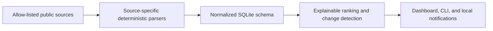

<div align="center">

# AI Resource Radar

**Daily-verified global AI APIs, GPU compute, and prices—filtered by regional availability, signup requirements, and real integration steps.**

[](https://github.com/ai-resource-radar/ai-resource-radar/actions/workflows/ci.yml)
[](https://github.com/ai-resource-radar/ai-resource-radar/actions/workflows/pages.yml)
[](https://github.com/ai-resource-radar/ai-resource-radar/releases/latest)
[](https://pypi.org/project/ai-resource-radar/)
[](https://ai-resource-radar.github.io/ai-resource-radar/)
[](https://ai-resource-radar.github.io/ai-resource-radar/data/source-health.json)
[](https://ai-resource-radar.github.io/ai-resource-radar/data/resources.json)
[](https://www.python.org/)
[](LICENSE)

[Live Radar](https://ai-resource-radar.github.io/ai-resource-radar/) · [Data](https://ai-resource-radar.github.io/ai-resource-radar/data/manifest.json) · [Atom feed](https://ai-resource-radar.github.io/ai-resource-radar/en/feed.xml) · [RSS feed](https://ai-resource-radar.github.io/ai-resource-radar/en/rss.xml) · [Start with uvx](#start-with-uvx) · [中文站](https://ai-resource-radar.github.io/ai-resource-radar/zh/) · [中文 README](README.zh-CN.md)

[How it works](#how-it-works) · [Public-site contract](docs/PUBLIC_SITE.md) · [Security](docs/SECURITY.md)

</div>


*The public radar exposes a current, read-only view without requiring an account or API key.*

AI Resource Radar is a global-first, local-first tracker for free AI tiers, GPU compute, grants, and prices. It
keeps the source and verification time beside each result, so the answer is practical: **what is
free, how much you get, when it resets, what the restrictions are, and how to claim it**.

The default collection pipeline is deterministic: **no AI, API key, cookie, or account data is
required**. Optional reviewable features remain isolated from collection and cannot change its
verified evidence.

## Start with uvx

Try the keyless collector without creating a checkout or virtual environment:

```bash
uvx ai-resource-radar start --open
```

For the hosted snapshot, use [Live Radar](https://ai-resource-radar.github.io/ai-resource-radar/) or fetch
the documented [public data manifest](https://ai-resource-radar.github.io/ai-resource-radar/data/manifest.json).
The public site is an aggregate view; always follow an official source before relying on an offer.
Its v0.9.0 snapshot makes English the global default, adds country-level availability and explicit
signup requirements, and gives every built-in official A/B offer deterministic English and Chinese
presentation text. The hosted snapshot remains static and read-only, and Pages binds each build to
a fresh 23-source refresh and Git commit.

## Public scenarios, feeds, and search visibility

The hosted site publishes six read-only scenario pages in both languages at
`/en/scenarios/<slug>/` and `/zh/scenarios/<slug>/`. They turn common intents into short paths
through the public catalogue; they do not create an account, personalize a result, or promise that
an offer is still available.

The English homepage auto-discovers Atom at `/en/feed.xml` and RSS at `/en/rss.xml`; the stable root
`/feed.xml` and `/rss.xml` addresses remain Chinese-compatible. Entries contain stable hash IDs, bounded
public facts, observed times, and safe same-origin or official-source links. They are a convenient
read-only snapshot, not a guarantee of quota, price, eligibility, or availability. Use GitHub Watch
for release and maintenance updates; it is not a substitute for the daily resource feeds.

Production Pages can opt into Google Search Console site verification. The builder reads the
repository secret only through `AI_RADAR_GOOGLE_SITE_VERIFICATION_TOKEN` and renders it as Google's
required public verification marker in the homepage HTML. It omits the token from the manifest,
JSON/XML feeds, logs, and workflow output. Local builds keep `--search-console-provider none` by
default.

The 30-day discovery experiment starts at `experiment_started_at` in the public manifest. Its
success gate is intentionally modest: at least 10 of 12 scenario pages indexed, exposure in three
intent categories, and at least one click or bounded confirmation signal. This is an indexing and
reach check, not an exact conversion measurement: a confirmation does not prove a signup, purchase,
or other user-level conversion, and no user identity is exported.

## What you get

Free tiers and AI prices change frequently, while ordinary link lists quickly become stale.
This project turns public source material into a small, explainable local database:

| Capability | What you get |
| --- | --- |
| Free token radar | Quota, reset period, country availability, signup requirements, official evidence, and claim steps |
| Free GPU and grants | GPU time or credit, eligibility, expiry, limitations, and a direct official link |
| Token price leaderboard | Input/output/cached prices normalized per 1M tokens, with sorting and filters |
| GPU price leaderboard | On-demand GPU prices normalized per hour for practical comparison |
| Provider profiles | 20 bilingual official pages with free policy, prices, evidence, and verified integrations |
| Scenario pages and feeds | Six bilingual intent pages plus Atom/RSS snapshots with stable, public-only links |
| Change detection | New offers, quota or restriction changes, removals, and upcoming expiry |
| AI efficiency tips | Official guidance and manual articles stay pending until a human approves safe AGENTS.md application |


*Provider profiles keep the policy, evidence, verification time, and compatible integration examples together.*

## Quick start

Requires Python 3.11 or newer. Install from PyPI in an isolated environment:

```bash
python3 -m venv .venv
source .venv/bin/activate
python -m pip install ai-resource-radar

ai-radar refresh
ai-radar dashboard --open
```

The dashboard is available only on `127.0.0.1:18766`.


*The local Dashboard adds deeper filtering, claim steps, change history, and diagnostics without exposing local data.*

On macOS, install the dashboard, menu bar helper, and 08:00 daily job:

```bash
ai-radar service install
ai-radar service status
```

To uninstall the services without deleting the database:

```bash
ai-radar service uninstall
```

## Platform support

| Feature | macOS | Linux |
| --- | :---: | :---: |
| Collection, ranking, SQLite, and CLI | ✅ | ✅ |
| Local dashboard | ✅ | ✅ |
| Menu bar notifications and LaunchAgent | ✅ | — |

Windows is not tested yet. Linux CI verifies the deterministic core and dashboard; macOS CI also
compiles and tests the Vision OCR and menu bar helpers.

## What it tracks

The built-in adapters currently cover 23 sources:

| Category | Sources | Cadence |
| --- | --- | --- |
| Free token/API and image generation | OpenRouter, Groq, Gemini, Cloudflare Workers AI, Zhipu CogView-3-Flash, SambaNova, Mistral, Hugging Face Inference, SiliconFlow, Alibaba Model Studio, Cerebras | Daily |
| Free GPU and credits | Hugging Face ZeroGPU, Modal, Lightning AI, Kaggle, Google Colab | Daily |
| GPU market prices | Modal, RunPod, Lambda GPU Cloud, Vast.ai, Replicate, Baseten | Daily |
| Token prices | Replicate, Baseten, plus the `pydantic/genai-prices` baseline | Daily |
| Community discovery | `mnfst/awesome-free-llm-apis` | Weekly |

Community sources can discover candidates but cannot upgrade an offer to “officially verified”.
Each HTTPS source is allow-listed, limited to 16 MB, isolated on failure, and supports
ETag/Last-Modified caching.

## Explainable ranking

The radar deliberately avoids an opaque score:

| Tier | Meaning |
| --- | --- |
| A | Officially verified, no card, recurring free quota, and a published fixed quota |
| B | Officially verified and no card, but quota varies or eligibility conditions apply |
| C | Application, card, identity, top-up, waitlist, or one-time trial restrictions apply |
| D | Community discovery only; official verification is pending |

Region never changes the A–D tier. Without a country filter, results are ordered by estimated value
and recent changes. With a country filter, confirmed availability comes first and unknown results
appear only when explicitly requested. The dashboard shows the reasons instead of hiding them
inside a number.

## Optional extensions

### AI efficiency tips

Official guidance and manually imported articles remain candidates until a human approves them.
Approval is limited to the marked managed block in an `AGENTS.md`, creates a private backup, and is
auditable and reversible. See [docs/TIPS.md](docs/TIPS.md) for the safety model and
`ai-radar tips --help` for the CLI.

## How it works



One failed source never clears data from other sources. A missing offer is removed only after two
successful parses both confirm its absence. Parser drift keeps the last trusted value and marks the
source for verification.

## Useful commands

```bash
# Refresh all due sources, or bypass cadence
ai-radar refresh
ai-radar refresh --force

# Browse verified, no-card resources
ai-radar list --verified-only --no-card
ai-radar list --kind gpu --no-card

# Review recent changes
ai-radar changes --days 30

# Run the complete daily workflow
ai-radar daily

# Diagnose the database, source freshness, helpers, and services
ai-radar doctor
ai-radar doctor --json
```

Run `ai-radar <command> --help` for every filter and option.

## Data, privacy, and storage

- SQLite schema v8 uses file mode `0600`; no secrets, cookies, or account data are stored.
- Public scenario pages and Atom/RSS feeds contain only bounded, aggregate source facts and stable
  hash IDs; they never include local database IDs, request headers, cookies, or account data.
- Google Search Console verification is a production build concern only. Its token is read from the
  environment and rendered only in the required homepage verification marker; it is omitted from
  manifests, data feeds, logs, and workflow output. The Pages workflow never prints it.
- Tips retain only bounded summaries and evidence. Approval updates only the marked AGENTS.md managed block and creates a private backup under `~/.codex/backups/ai-tips/`.
- Full fetched pages are parsed in memory and are not archived.
- Fetch logs are retained for 90 days; ordinary changes and delivered notifications for 365 days.
- Important free-tier changes and unread notifications are retained.
- Periodic cleanup and threshold-based `VACUUM` prevent unbounded growth.
- The dashboard accepts only loopback Host/Origin requests and serves no remote assets.

See [Architecture](docs/ARCHITECTURE.md) and [Security](docs/SECURITY.md) for details.
Existing users should also read the [v0.2 migration guide](docs/MIGRATION.md); complete removal is
documented in [Uninstall](docs/UNINSTALL.md).

## Development

```bash
git clone https://github.com/ai-resource-radar/ai-resource-radar.git
cd ai-resource-radar
python3 -m venv .venv
source .venv/bin/activate
python -m pip install -e .

python -m unittest discover -s tests -p 'test_*.py'
node --check src/ai_resource_radar/web/ai-resources.js
```

Contributions are welcome. Start with [CONTRIBUTING.md](CONTRIBUTING.md), or open an issue with the
official source URL and the policy or price that needs attention.

## License

[MIT](LICENSE)
