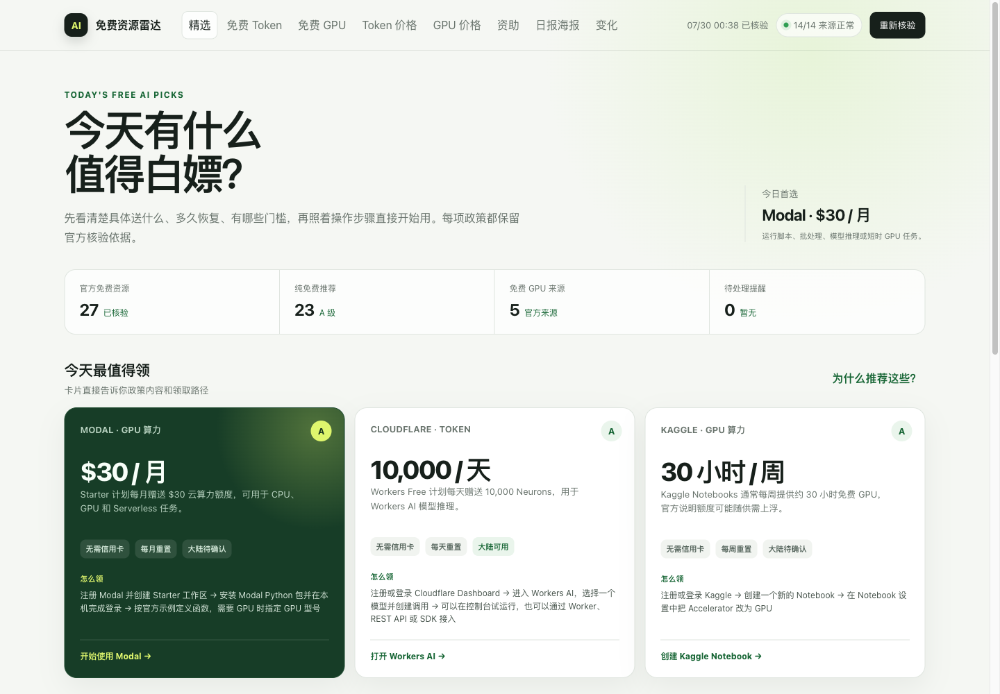
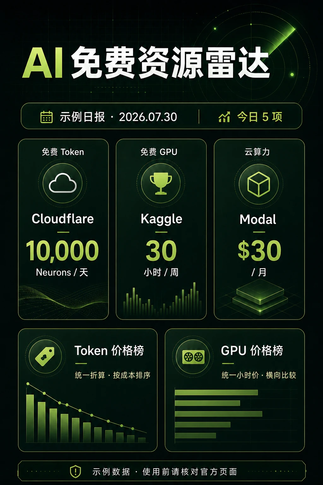
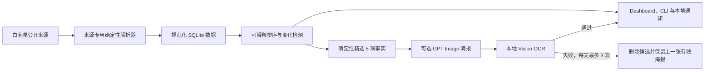

<div align="center">

# AI 免费资源雷达

**每天核验 AI 免费 Token、GPU 算力和市场价格，生成可解释的本地榜单与中文日报。**

[](https://github.com/ai-resource-radar/ai-resource-radar/actions/workflows/ci.yml)
[](https://github.com/ai-resource-radar/ai-resource-radar/releases/latest)
[](https://www.python.org/)
[](LICENSE)

[English](README.md) · [快速开始](#快速开始) · [工作原理](#工作原理) · [安全说明](docs/SECURITY.md)

</div>



AI 免费资源雷达是一个本地优先的免费政策和市场价格追踪器。它不只给出链接，还会直接说明
**送什么、送多少、多久恢复、有哪些门槛，以及怎样开始使用**。每项推荐都保留来源与核验时间。

默认采集链路完全由确定性脚本执行，**不调用 AI，不需要 API Key、Cookie 或账号信息**。
只有可选的日报海报会使用图片模型。

## 为什么做这个项目

免费额度和 AI 价格经常变化，普通收藏夹或链接目录很快就会过期。本项目把公开资料整理成一个
小型、可解释、可维护的本地数据库：

| 能力 | 你能看到什么 |
| --- | --- |
| 免费 Token 雷达 | 额度、重置周期、信用卡/手机号要求、大陆状态、官方证据和领取步骤 |
| 免费 GPU 与资助 | GPU 时间或 credits、资格、有效期、限制和官方入口 |
| Token 价格榜 | 统一折算每 100 万 Token 的输入、输出和缓存价格，并支持排序筛选 |
| GPU 价格榜 | 统一折算按需 GPU 小时价，方便横向比较 |
| 变化检测 | 新增、额度变化、限制变化、下架和即将到期 |
| 日报海报 | 3 项免费资源、1 项 Token 价格和 1 项 GPU 价格，整图生成并在本地 OCR 核验 |

## 快速开始

需要 Python 3.11 或更高版本。建议在独立虚拟环境安装已发布的 wheel：

```bash
python3 -m venv .venv
source .venv/bin/activate
python -m pip install \
  https://github.com/ai-resource-radar/ai-resource-radar/releases/download/v0.1.0/ai_resource_radar-0.1.0-py3-none-any.whl

ai-radar refresh
ai-radar dashboard --open
```

Dashboard 只监听本机地址 `127.0.0.1:18766`。

在 macOS 上安装 Dashboard、菜单栏和每天 08:00 的任务：

```bash
ai-radar service install
ai-radar service status
```

卸载服务不会删除数据库：

```bash
ai-radar service uninstall
```

## 平台支持

| 功能 | macOS | Linux |
| --- | :---: | :---: |
| 采集、排序、SQLite 和 CLI | ✅ | ✅ |
| 本地 Dashboard | ✅ | ✅ |
| GPT Image 日报与 Vision OCR | ✅ | — |
| 菜单栏通知和 LaunchAgent | ✅ | — |

Windows 尚未经过验证。Linux CI 会检查确定性核心和 Dashboard；macOS CI 还会编译并测试
Vision OCR 与菜单栏 Helper。

## 当前追踪范围

内置适配器目前覆盖 14 个来源：

| 类别 | 来源 | 周期 |
| --- | --- | --- |
| 免费 Token/API | OpenRouter、Groq、Gemini、Cloudflare Workers AI | 每日 |
| 免费 GPU 与 credits | Hugging Face ZeroGPU、Modal、Lightning AI、Kaggle、Google Colab | 每日 |
| GPU 市场价格 | Modal、RunPod、Lambda GPU Cloud、Vast.ai | 每日 |
| Token 价格基线 | `pydantic/genai-prices` | 每日 |
| 社区线索发现 | `mnfst/awesome-free-llm-apis` | 每周 |

社区目录只能发现候选，不能把资源升级为“官方已核验”。所有 HTTPS 来源都经过白名单限制，
单次响应不超过 16 MB，彼此故障隔离，并支持 ETag/Last-Modified 缓存。

## 可解释排序

雷达刻意不使用不透明总分：

| 等级 | 含义 |
| --- | --- |
| A | 官方核验、无需信用卡、周期性免费、大陆未明确不可用 |
| B | 官方核验且无需信用卡，但额度浮动或存在资格条件 |
| C | 需要申请、信用卡、特定地区或属于一次性试用 |
| D | 仅社区发现，尚待官方核验 |

同等级按照大陆支持情况、估算价值和最近变化排序。Dashboard 会展示具体理由，而不是只给一个
无法解释的数字。

## 纯图片日报

<p align="center">
  
</p>

> 上图已明确标注为示例数据；实际使用前始终应核对最新官方页面。

图片模型负责绘制整张海报，程序不会在模型输出上覆盖或补画正文。5 项事实由确定性脚本选择，
随后由 macOS Vision 在本地检查标题、日期、服务商、额度、价格和意外出现的数字。

```bash
ai-radar poster key set
ai-radar poster generate
ai-radar poster latest
```

OpenAI Key 通过隐藏输入写入 macOS 钥匙串。GPT Image 2 需要付费 API 访问；自动任务与手动操作
共享每天最多 3 次图片调用的硬上限。三次 OCR 都不通过时，当日不会发布，Dashboard 会继续展示
上一张有效海报。

## 工作原理



单个来源失败不会清空其他来源的数据。资源只有在连续两次成功解析都确认缺失后才会下架；页面
结构变化时保留最后可信值，并将来源标记为待核验。

## 常用命令

```bash
# 刷新到期来源，或绕过周期强制刷新
ai-radar refresh
ai-radar refresh --force

# 查看官方核验、无需信用卡的资源
ai-radar list --verified-only --no-card
ai-radar list --kind gpu --no-card

# 查看最近变化
ai-radar changes --days 30

# 执行完整每日流程
ai-radar daily
```

执行 `ai-radar <命令> --help` 可以查看全部筛选参数。

## 数据、隐私与存储

- SQLite schema v4，数据库权限为 `0600`，不保存密钥、Cookie 或账号信息。
- 完整网页只在内存中解析，不会作为历史网页归档。
- 抓取日志保留 90 天，普通变化和已送达通知保留 365 天。
- 重要免费政策变化和未读通知持续保留。
- 海报保留 90 天，失败候选图片立即删除。
- 自动清理和按阈值执行的 `VACUUM` 可防止数据库无限增长。
- Dashboard 只接受本机 Host/Origin，静态资源全部来自本地。

详细说明见[架构文档](docs/ARCHITECTURE.md)和[安全文档](docs/SECURITY.md)。

## 开发

```bash
git clone https://github.com/ai-resource-radar/ai-resource-radar.git
cd ai-resource-radar
python3 -m venv .venv
source .venv/bin/activate
python -m pip install -e .

python -m unittest discover -s tests -p 'test_*.py'
node --check src/ai_resource_radar/web/ai-resources.js
```

欢迎贡献。请先阅读 [CONTRIBUTING.md](CONTRIBUTING.md)，也可以在 Issue 中附上需要关注的
官方来源地址、免费政策或价格变化。

## License

[MIT](LICENSE)
