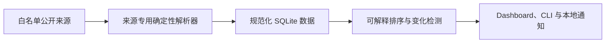

<div align="center">

# AI 免费资源雷达

**每天核验免费 AI Token、GPU 算力和价格变化，告诉你送什么、怎么领。**

[](https://github.com/ai-resource-radar/ai-resource-radar/actions/workflows/ci.yml)
[](https://github.com/ai-resource-radar/ai-resource-radar/actions/workflows/pages.yml)
[](https://github.com/ai-resource-radar/ai-resource-radar/releases/latest)
[](https://pypi.org/project/ai-resource-radar/)
[](https://ai-resource-radar.github.io/ai-resource-radar/)
[](https://ai-resource-radar.github.io/ai-resource-radar/data/source-health.json)
[](https://ai-resource-radar.github.io/ai-resource-radar/data/resources.json)
[](https://www.python.org/)
[](LICENSE)

[Live Radar](https://ai-resource-radar.github.io/ai-resource-radar/) · [Data](https://ai-resource-radar.github.io/ai-resource-radar/data/manifest.json) · [Atom 订阅](https://ai-resource-radar.github.io/ai-resource-radar/feed.xml) · [RSS 订阅](https://ai-resource-radar.github.io/ai-resource-radar/rss.xml) · [uvx 开始](#用-uvx-开始) · [English](README.md)

[工作原理](#工作原理) · [公开站点说明](docs/PUBLIC_SITE.md) · [安全说明](docs/SECURITY.md)

</div>


*公开雷达无需登录或 API Key，提供最新的只读资源快照。*

AI 免费资源雷达是一个本地优先的免费 Token、GPU 算力、资助和价格追踪器。不只给出链接，还会直接说明
**送什么、送多少、多久恢复、有哪些门槛，以及怎样开始使用**；每项结果都保留来源与核验时间。

默认采集链路完全由确定性脚本执行，**不调用 AI，不需要 API Key、Cookie 或账号信息**。
需要人工审核的可选功能与采集链路隔离，也不能改变已核验的证据。

## 用 uvx 开始

不用先创建代码目录或虚拟环境，即可试用无密钥采集：

```bash
uvx ai-resource-radar start --open
```

也可以直接打开 [Live Radar](https://ai-resource-radar.github.io/ai-resource-radar/)，或下载有版本说明的
[公开数据清单](https://ai-resource-radar.github.io/ai-resource-radar/data/manifest.json)。公开站点只是聚合视图，
实际使用前仍应打开官方来源核对政策。
v0.8.0 的公共站新增 6 个双语场景页、稳定的 Atom/RSS 订阅、可索引的中英文服务商页面、
经过兼容门禁的接入示例和按需数据加载，同时继续保持纯静态只读；Pages 每次发布都会绑定本轮
23 个来源的刷新结果和对应 Git 提交。

## 公共场景页、订阅与搜索可见性

托管站点在 `/zh/scenarios/<slug>/` 和 `/en/scenarios/<slug>/` 提供 6 个只读场景页（共 12 个
地址）。它们把常见使用意图串成公开目录中的短路径；不会创建账号、个性化结果，也不承诺资源
仍然有效。

资源与变化流可通过 `/feed.xml`（Atom）和 `/rss.xml`（RSS）订阅，英文版本分别位于
`/en/feed.xml` 和 `/en/rss.xml`。每条记录使用稳定哈希 ID，包含有界的公开事实、观察时间和安全的
同源或官方链接。订阅只是只读快照，不保证额度、价格、资格或可用性；版本与维护动态请使用
GitHub Watch，不要把它当成每日资源订阅的替代品。

生产 Pages 可以启用 Google Search Console 站点验证。构建器只从
`AI_RADAR_GOOGLE_SITE_VERIFICATION_TOKEN` 环境变量读取仓库密钥；Token 只写入 Google 要求的首页
公开验证 meta 标记，不进入清单、日志或订阅。本地构建默认使用
`--search-console-provider none`。

30 天发现实验的起点记录在公开清单的 `experiment_started_at`。门槛保持克制：12 个场景页至少有
10 个被索引、覆盖 3 类意图曝光，并出现至少一次点击或有界的确认信号。这是索引与触达健康检查，
不是精确转化统计：确认不等于注册、购买或其他用户级转化，系统也不会导出用户身份。

## 你能得到什么

免费额度和 AI 价格经常变化，普通收藏夹或链接目录很快就会过期。本项目把公开资料整理成一个
小型、可解释、可维护的本地数据库：

| 能力 | 你能看到什么 |
| --- | --- |
| 免费 Token 雷达 | 额度、重置周期、信用卡/手机号要求、大陆状态、官方证据和领取步骤 |
| 免费 GPU 与资助 | GPU 时间或 credits、资格、有效期、限制和官方入口 |
| Token 价格榜 | 统一折算每 100 万 Token 的输入、输出和缓存价格，并支持排序筛选 |
| GPU 价格榜 | 统一折算按需 GPU 小时价，方便横向比较 |
| 服务商档案 | 20 个中英文官方页面，集中展示免费政策、价格、证据和已核验接入示例 |
| 场景页与订阅 | 6 个双语意图页面，以及使用稳定公共链接的 Atom/RSS 快照 |
| 变化检测 | 新增、额度变化、限制变化、下架和即将到期 |
| AI 效率技巧 | 官方技巧与手动文章先进入候选，人工批准后安全写入全局或项目 AGENTS.md |


*服务商页面把政策、证据、核验时间和兼容的接入示例放在一起。*

## 快速开始

需要 Python 3.11 或更高版本。建议在独立虚拟环境从 PyPI 安装：

```bash
python3 -m venv .venv
source .venv/bin/activate
python -m pip install ai-resource-radar

ai-radar refresh
ai-radar dashboard --open
```

Dashboard 只监听本机地址 `127.0.0.1:18766`。


*本机 Dashboard 提供更深的筛选、领取步骤、变化历史和诊断，不会对外暴露本地数据。*

在 macOS 上安装 Dashboard、菜单栏和每天 08:00 的任务：

```bash
ai-radar service install
ai-radar service status
```

卸载服务不会删除数据库：

```bash
ai-radar service uninstall
```

## 平台支持

| 功能 | macOS | Linux |
| --- | :---: | :---: |
| 采集、排序、SQLite 和 CLI | ✅ | ✅ |
| 本地 Dashboard | ✅ | ✅ |
| 菜单栏通知和 LaunchAgent | ✅ | — |

Windows 尚未经过验证。Linux CI 会检查确定性核心和 Dashboard；macOS CI 还会编译并测试
Vision OCR 与菜单栏 Helper。

## 当前追踪范围

内置适配器目前覆盖 23 个来源：

| 类别 | 来源 | 周期 |
| --- | --- | --- |
| 免费 Token/API 与生图 | OpenRouter、Groq、Gemini、Cloudflare Workers AI、智谱 CogView-3-Flash、SambaNova、Mistral、Hugging Face Inference、SiliconFlow、阿里云百炼、Cerebras | 每日 |
| 免费 GPU 与 credits | Hugging Face ZeroGPU、Modal、Lightning AI、Kaggle、Google Colab | 每日 |
| GPU 市场价格 | Modal、RunPod、Lambda GPU Cloud、Vast.ai、Replicate、Baseten | 每日 |
| Token 价格 | Replicate、Baseten，以及 `pydantic/genai-prices` 基线 | 每日 |
| 社区线索发现 | `mnfst/awesome-free-llm-apis` | 每周 |

社区目录只能发现候选，不能把资源升级为“官方已核验”。所有 HTTPS 来源都经过白名单限制，
单次响应不超过 16 MB，彼此故障隔离，并支持 ETag/Last-Modified 缓存。

## 可解释排序

雷达刻意不使用不透明总分：

| 等级 | 含义 |
| --- | --- |
| A | 官方核验、无需信用卡、周期性免费、大陆未明确不可用 |
| B | 官方核验且无需信用卡，但额度浮动或存在资格条件 |
| C | 需要申请、信用卡、特定地区或属于一次性试用 |
| D | 仅社区发现，尚待官方核验 |

同等级按照大陆支持情况、估算价值和最近变化排序。Dashboard 会展示具体理由，而不是只给一个
无法解释的数字。

## 可选扩展

### AI 效率技巧

官方指南和手动导入的文章会先保持候选状态，必须人工批准后才会写入 `AGENTS.md` 的标记区块。
每次应用都会创建私有备份，并支持审计和回滚。安全模型见[技巧说明](docs/TIPS.md)，命令行可运行
`ai-radar tips --help` 查看详情。

## 工作原理



单个来源失败不会清空其他来源的数据。资源只有在连续两次成功解析都确认缺失后才会下架；页面
结构变化时保留最后可信值，并将来源标记为待核验。

## 常用命令

```bash
# 刷新到期来源，或绕过周期强制刷新
ai-radar refresh
ai-radar refresh --force

# 查看官方核验、无需信用卡的资源
ai-radar list --verified-only --no-card
ai-radar list --kind gpu --no-card

# 查看最近变化
ai-radar changes --days 30

# 执行完整每日流程
ai-radar daily

# 检查数据库、来源新鲜度、Helper 与常驻服务
ai-radar doctor
ai-radar doctor --json

# 查看、导入、批准和回滚效率技巧
ai-radar tips list --status candidate
ai-radar tips refresh
ai-radar tips import --url https://example.com/tip --title "标题" --category context --summary "摘要" --instruction "具体做法"
ai-radar tips approve <tip-id> --scope global
ai-radar tips approve-batch <tip-id-1> <tip-id-2> <tip-id-3> --scope both --adopt-existing
ai-radar tips applications
ai-radar tips rollback <application-id>
ai-radar tips rollback-batch <batch-id>
```

执行 `ai-radar <命令> --help` 可以查看全部筛选参数。

## 数据、隐私与存储

- SQLite schema v7，数据库权限为 `0600`，不保存密钥、Cookie 或账号信息。
- 公共场景页和 Atom/RSS 订阅只包含有界的聚合来源事实与稳定哈希 ID，不包含本地数据库 ID、请求
  头、Cookie 或账号信息。
- Google Search Console 验证只在生产构建中启用。Token 从环境变量读取，只出现在 Google 要求的
  首页验证 meta 标记中，不进入清单或订阅，Pages Workflow 也不会打印。
- 效率技巧只保存短摘要和必要证据；全部需要人工批准。批准后仅更新带标记的 AGENTS.md 受管区块，并在 `~/.codex/backups/ai-tips/` 创建私有备份。
- 完整网页只在内存中解析，不会作为历史网页归档。
- 抓取日志保留 90 天，普通变化和已送达通知保留 365 天。
- 重要免费政策变化和未读通知持续保留。
- 自动清理和按阈值执行的 `VACUUM` 可防止数据库无限增长。
- Dashboard 只接受本机 Host/Origin，静态资源全部来自本地。

详细说明见[架构文档](docs/ARCHITECTURE.md)和[安全文档](docs/SECURITY.md)。
从旧版本升级请阅读[v0.2 迁移指南](docs/MIGRATION.md)；需要彻底移除时请阅读[卸载说明](docs/UNINSTALL.md)。

## 开发

```bash
git clone https://github.com/ai-resource-radar/ai-resource-radar.git
cd ai-resource-radar
python3 -m venv .venv
source .venv/bin/activate
python -m pip install -e .

python -m unittest discover -s tests -p 'test_*.py'
node --check src/ai_resource_radar/web/ai-resources.js
```

欢迎贡献。请先阅读 [CONTRIBUTING.md](CONTRIBUTING.md)，也可以在 Issue 中附上需要关注的
官方来源地址、免费政策或价格变化。

## License

[MIT](LICENSE)
